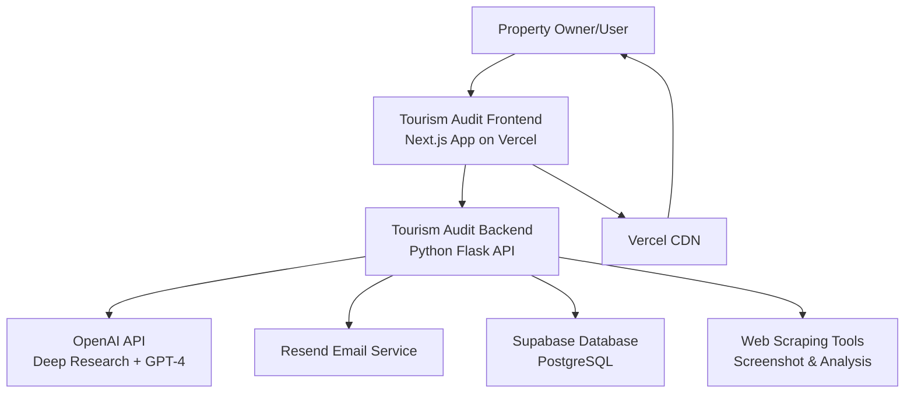
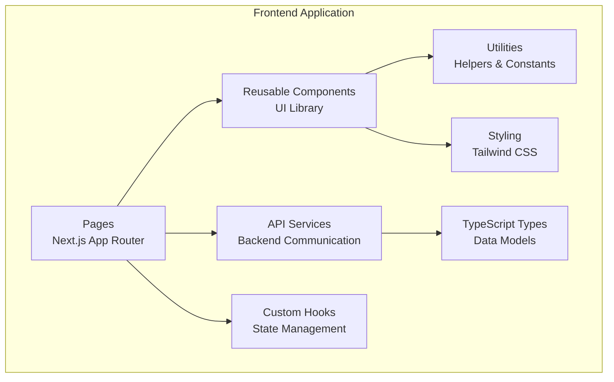
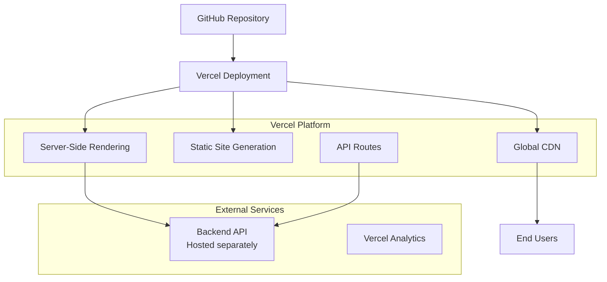
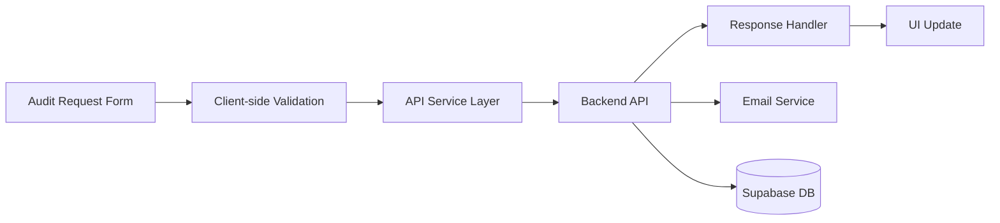

# Tourism Audit Frontend - Architecture Document

## 1. Introduction
*   **Project Name:** Tourism Audit Frontend
*   **Document Version:** 1.0
*   **Date:** August 5, 2025
*   **Author(s):** AI Development Team
*   **Purpose:** This document describes the architecture of the Tourism Audit Frontend application - a Next.js web application that provides an interface for the Tourism Audit system, allowing users to request digital audits for their tourism properties. The frontend communicates with the backend API and will be hosted on Vercel.

## 2. Goals
*   **Architectural Goals:** 
    - **Scalability:** Support high traffic volumes with efficient static generation and CDN distribution via Vercel
    - **Performance:** Fast loading times through Next.js optimization, static site generation, and image optimization
    - **Security:** Secure API communication with the backend, form validation, and protection against common web vulnerabilities
    - **Maintainability:** Clean, modular component architecture with TypeScript for type safety
    - **Responsiveness:** Mobile-first design approach with consistent UX across all devices
    - **SEO:** Server-side rendering for better search engine optimization
*   **Business Goals:** 
    - Provide an intuitive interface for tourism property owners to request digital audits
    - Showcase audit results in a user-friendly format
    - Generate leads and conversions for the audit service
    - Build trust and credibility through professional presentation
    - Support Romanian market requirements with localized content

## 3. System Overview
*   **System Context Diagram:** 

*   **Component Diagram:** 

*   **Deployment Diagram:**

## 4. Components
### 4.1. Pages & Routing (Next.js App Router)
*   **Description:** Handles application routing, page-level components, and SSR/SSG logic
*   **Responsibilities:** 
    - Route management and navigation
    - Page-level data fetching
    - SEO optimization with metadata
    - Server-side rendering where needed
*   **Interfaces:** File-based routing system, page components export default functions
*   **Dependencies:** Next.js App Router, React, TypeScript
*   **Implementation Details:** Located in `src/app/` directory with layout.tsx and page.tsx files

### 4.2. UI Components Library
*   **Description:** Reusable React components built with Radix UI primitives and styled with Tailwind CSS
*   **Responsibilities:** 
    - Provide consistent UI elements across the application
    - Handle component-level state and interactions
    - Ensure accessibility compliance
    - Maintain design system consistency
*   **Interfaces:** React component props interfaces defined with TypeScript
*   **Dependencies:** React, Radix UI, Tailwind CSS, class-variance-authority, clsx
*   **Implementation Details:** Located in `src/components/` with shadcn/ui component structure

### 4.3. API Services Layer
*   **Description:** Handles all communication with the backend API
*   **Responsibilities:** 
    - HTTP request/response handling
    - Error handling and retry logic
    - Data transformation and validation
    - Authentication token management
*   **Interfaces:** TypeScript service functions with typed parameters and return values
*   **Dependencies:** Fetch API, TypeScript types
*   **Implementation Details:** Located in `src/services/` with dedicated service files

### 4.4. Custom Hooks
*   **Description:** Reusable React hooks for state management and side effects
*   **Responsibilities:** 
    - Manage component state logic
    - Handle API data fetching and caching
    - Provide reusable stateful logic
    - Form state management
*   **Interfaces:** Custom hook functions returning state and handlers
*   **Dependencies:** React hooks, API services
*   **Implementation Details:** Located in `src/hooks/` directory

### 4.5. Type Definitions
*   **Description:** TypeScript type definitions for data models and API interfaces
*   **Responsibilities:** 
    - Define data structures used throughout the application
    - Ensure type safety for API communication
    - Provide IntelliSense support
*   **Interfaces:** TypeScript interfaces and types
*   **Dependencies:** TypeScript
*   **Implementation Details:** Located in `src/types/` directory

## 5. Data Architecture
*   **Data Model:** 
    - **Property Data:** Information about tourism properties (name, website, contact details, marketing goals)
    - **Audit Request:** User-submitted requests for digital audits
    - **Audit Results:** Structured audit reports with status indicators (✅⚠️❌) and action items
    - **User Session:** Temporary session data for form progress and preferences
*   **Data Storage:** 
    - **Frontend State:** React component state and custom hooks for temporary data
    - **Browser Storage:** localStorage for user preferences and form draft data
    - **Backend Communication:** RESTful API calls for persistent data operations
    - **No Direct Database:** Frontend communicates only through backend API
*   **Data Flow:**

## 6. Security
*   **Security Requirements:** 
    - Secure communication with backend API over HTTPS
    - Client-side input validation and sanitization
    - Protection against XSS and CSRF attacks
    - Secure handling of sensitive user data
    - Rate limiting on form submissions
*   **Security Measures:**
    - **HTTPS Enforcement:** All communications encrypted via Vercel's automatic HTTPS
    - **Input Validation:** Comprehensive form validation with TypeScript types
    - **Sanitization:** HTML sanitization for any user-generated content display
    - **CSP Headers:** Content Security Policy headers configured in Next.js
    - **API Security:** Backend API handles authentication and authorization
    - **Environment Variables:** Sensitive configuration stored securely in Vercel environment
    - **No Client-side Secrets:** All API keys and sensitive data handled server-side

## 7. Scalability
*   **Scalability Requirements:** 
    - Handle increased traffic during peak tourism seasons
    - Support multiple concurrent audit requests
    - Maintain performance under high load
    - Scale globally with CDN distribution
*   **Scalability Strategy:**
    - **Static Site Generation:** Pre-generate static pages for optimal performance
    - **CDN Distribution:** Leverage Vercel's global CDN for fast content delivery
    - **Code Splitting:** Automatic code splitting with Next.js for smaller bundle sizes
    - **Image Optimization:** Next.js Image component for optimized loading
    - **Caching Strategy:** Browser caching and CDN caching for static assets
    - **Serverless Functions:** Use Vercel's serverless functions for API routes if needed
    - **Performance Monitoring:** Vercel Analytics for performance tracking

## 8. Performance
*   **Performance Requirements:** 
    - First Contentful Paint (FCP) < 2 seconds
    - Largest Contentful Paint (LCP) < 2.5 seconds
    - Cumulative Layout Shift (CLS) < 0.1
    - First Input Delay (FID) < 100ms
    - Time to Interactive (TTI) < 3 seconds
*   **Performance Optimization:**
    - **Next.js Optimization:** Automatic code splitting, image optimization, and font optimization
    - **Static Generation:** Pre-generate static pages where possible
    - **Tree Shaking:** Remove unused code from bundles
    - **Lazy Loading:** Lazy load components and images below the fold
    - **Compression:** Gzip/Brotli compression via Vercel
    - **Critical CSS:** Inline critical CSS for above-the-fold content
    - **Web Vitals Monitoring:** Track Core Web Vitals with Vercel Analytics

## 9. Technology Stack
*   **Frontend Framework:** Next.js 15.4.5 (React 19.1.0)
*   **Language:** TypeScript 5.x
*   **Styling:** Tailwind CSS 4.x
*   **UI Components:** 
    - Radix UI primitives (@radix-ui/react-*)
    - shadcn/ui component library
    - Lucide React icons
*   **State Management:** React built-in state + custom hooks
*   **Form Handling:** React Hook Form (to be added)
*   **HTTP Client:** Native Fetch API
*   **Development Tools:**
    - ESLint for code linting
    - TypeScript for type checking
    - Next.js built-in bundling (Turbopack)
*   **Deployment Platform:** Vercel
*   **Version Control:** Git (GitHub)
*   **Package Manager:** npm/yarn

## 10. Deployment
*   **Deployment Platform:** Vercel
*   **Deployment Process:**
    1. **Git Integration:** Automatic deployments triggered by GitHub commits
    2. **Build Process:** Next.js build with static optimization
    3. **Environment Configuration:** Environment variables managed through Vercel dashboard
    4. **Preview Deployments:** Automatic preview deployments for pull requests
    5. **Production Deployment:** Automatic deployment to production from main branch
*   **Deployment Environment:**
    - **CDN:** Global distribution via Vercel Edge Network
    - **Compute:** Serverless functions for API routes
    - **Storage:** Static assets stored on Vercel's infrastructure
*   **Deployment Configuration:**
    - Custom domain configuration
    - SSL certificates automatically managed
    - Performance monitoring enabled
    - Analytics integration

## 11. Monitoring
*   **Monitoring Tools:**
    - **Vercel Analytics:** Performance monitoring and Web Vitals tracking
    - **Browser DevTools:** Development-time performance analysis
    - **Lighthouse:** Regular performance audits
*   **Key Metrics:**
    - **Performance Metrics:** Core Web Vitals (LCP, FID, CLS)
    - **User Experience:** Page load times, bounce rates
    - **Error Tracking:** JavaScript errors and API failures
    - **Usage Analytics:** Page views, user flows, conversion rates
*   **Alerting:** Vercel dashboard notifications for deployment failures and performance degradation

## 12. Open Issues
*   **Backend API Integration:** Final API endpoints and data contracts need to be confirmed
*   **Authentication Strategy:** Determine if user authentication is required for audit requests
*   **Form Validation:** Detailed validation rules for property data inputs
*   **Error Handling:** Comprehensive error handling strategy for API failures
*   **Internationalization:** Future support for multiple languages beyond Romanian
*   **SEO Strategy:** Meta tags and structured data for better search engine visibility

## 13. Future Considerations
*   **User Dashboard:** Allow users to track audit request status and view historical audits
*   **Payment Integration:** Integrate payment processing for premium audit services
*   **Multi-language Support:** Expand beyond Romanian to support international markets
*   **Mobile App:** Consider React Native app for mobile users
*   **API Documentation:** Interactive API documentation for third-party integrations
*   **A/B Testing:** Implement testing framework for conversion optimization
*   **Advanced Analytics:** Enhanced tracking for business intelligence

## 14. Glossary
*   **SSG:** Static Site Generation - pre-rendering pages at build time
*   **SSR:** Server-Side Rendering - rendering pages on each request
*   **CDN:** Content Delivery Network - distributed servers for fast content delivery
*   **API:** Application Programming Interface - interface for software communication
*   **UI:** User Interface - visual elements users interact with
*   **UX:** User Experience - overall experience of using the application
*   **TypeScript:** Strongly typed programming language built on JavaScript
*   **Tailwind CSS:** Utility-first CSS framework
*   **Radix UI:** Low-level UI primitives for building design systems
*   **Vercel:** Cloud platform for frontend frameworks and static sites

---

**Example Prompts for Filling Out This Template:**

*   "What are the main architectural goals of this project? What are the key priorities?"
*   "What are the major components of the system? How do they interact with each other?"
*   "What is the data model used by the system? How is data stored and accessed?"
*   "What are the security requirements for the system? How will security be ensured?"
*   "How will the system be scaled to meet future demands? What is the scalability strategy?"
*   "What technologies will be used in this project? Why were these technologies chosen?"
